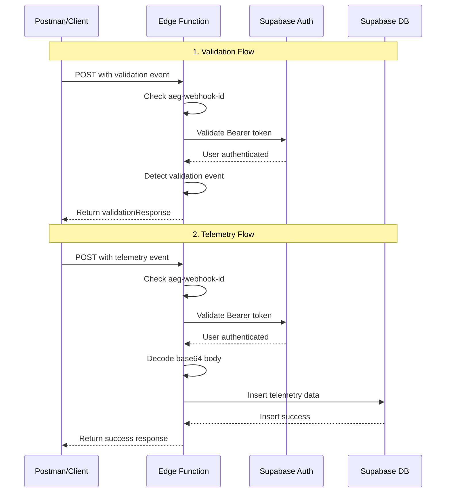

# Testing Azure Event Grid Integration with Supabase Edge Function

## Overview

The Supabase Edge Function handles Azure IoT Hub telemetry data through Azure Event Grid. It validates incoming requests, authenticates users, and stores device telemetry data.

## Key Changes in the Edge Function

1. **Event Grid Webhook Validation**: Checks for `aeg-webhook-id` header
2. **Base64 Decoding**: Telemetry body is base64-encoded and must be decoded
3. **User Authentication**: Validates Supabase Bearer token
4. **Data Structure**: Maps Azure IoT data to Supabase `azure_data` table

### Data Mapping

| Azure Field                                    | Supabase Field     | Description            |
| ---------------------------------------------- | ------------------ | ---------------------- |
| `body.state.totalRoundCount`                   | `round_count`      | Total round count      |
| `body.state.totalSlimCount`                    | `slim_count`       | Total slim count       |
| `body.state.totalVoidRoundMl`                  | `round_void_count` | Total void round in mL |
| `body.state.totalVoidSlimMl`                   | `slim_void_count`  | Total void slim in mL  |
| `systemProperties.iothub-connection-device-id` | `azure_device_id`  | Device ID              |
| `systemProperties.iothub-enqueuedtime`         | `enqueued_at`      | Timestamp              |
| `body` (decoded)                               | `raw_payload`      | Full decoded JSON      |

## Prerequisites

1. **Supabase Edge Function Deployed**: Your function should be deployed at a URL like:

   ```
   https://<project-ref>.supabase.co/functions/v1/azure-stream-data
   ```

2. **Supabase User Account**: You need a valid user with authentication token

3. **Environment Variables** in Supabase Edge Function:
   - `SUPABASE_URL`
   - `SUPABASE_SERVICE_ROLE_KEY`
   - `SUPABASE_ANON_KEY`

## Step-by-Step Testing Guide

### Step 1: Get Your Supabase Auth Token

You need a valid Bearer token for authentication.

**Option A: Using Supabase Dashboard**

1. Go to your Supabase project
2. Navigate to **Authentication** → **Users**
3. Create a test user or use existing one
4. Use the **API** tab to get an access token

**Option B: Using Sign-In API**

```bash
curl -X POST 'https://<project-ref>.supabase.co/auth/v1/signup' \
  -H "apikey: <SUPABASE_ANON_KEY>" \
  -H "Content-Type: application/json" \
  -d '{
    "email": "test@example.com",
    "password": "securepassword123"
  }'
```

Save the `access_token` from the response.

### Step 2: Test Validation Event (Subscription Validation)

Azure Event Grid sends this event to verify endpoint ownership.

**Request Details:**

- **Method**: POST
- **URL**: `https://<project-ref>.supabase.co/functions/v1/azure-stream-data`
- **Headers**:
  ```
  Authorization: Bearer <your-supabase-token>
  aeg-webhook-id: 31621620-ee99-465a-b917-fc568d2a7add
  Content-Type: application/json
  ```

**Request Body:**

```json
[
  {
    "id": "2d1781af-3a4c-4d7c-bd0c-e34b19da4e66",
    "topic": "/subscriptions/xxxxxxxx-xxxx-xxxx-xxxx-xxxxxxxxxxxx",
    "subject": "",
    "data": {
      "validationCode": "512d38b6-c7b8-40c8-89fe-f46f9e9622b6",
      "validationUrl": "https://rp-eastus2.eventgrid.azure.net:553/eventsubscriptions/myeventsub/validate?id=0000000000-0000-0000-0000-00000000000000&t=2022-10-28T04:23:35.1981776Z&apiVersion=2018-05-01-preview&token=1A1A1A1A"
    },
    "eventType": "Microsoft.EventGrid.SubscriptionValidationEvent",
    "eventTime": "2022-10-28T04:23:35.1981776Z",
    "metadataVersion": "1",
    "dataVersion": "1"
  }
]
```

**Expected Response (200 OK):**

```json
{
  "validationResponse": "512d38b6-c7b8-40c8-89fe-f46f9e9622b6"
}
```

### Step 3: Test Telemetry Event (Device Data)

This is the actual device data coming from Azure IoT Hub.

**Request Details:**

- **Method**: POST
- **URL**: `https://<project-ref>.supabase.co/functions/v1/azure-stream-data`
- **Headers**:
  ```
  Authorization: Bearer <your-supabase-token>
  aeg-webhook-id: 31621620-ee99-465a-b917-fc568d2a7add
  Content-Type: application/json
  ```

**Request Body:**

```json
[
  {
    "id": "9425838c-acf3-0686-553b-e1dd312fab91",
    "topic": "/SUBSCRIPTIONS/7548AB99-9A3A-4FEF-A1E0-7D3E9C3761DD/RESOURCEGROUPS/PERSONALRESOURCEGROUP/PROVIDERS/MICROSOFT.DEVICES/IOTHUBS/PERSONALOTHUB",
    "subject": "devices/Device-cdafcbc0b106",
    "eventType": "Microsoft.Devices.DeviceTelemetry",
    "data": {
      "properties": {},
      "systemProperties": {
        "iothub-content-type": "application/json",
        "iothub-content-encoding": "utf-8",
        "iothub-connection-device-id": "Device-cdafcbc0b106",
        "iothub-connection-auth-method": "{\"scope\":\"device\",\"type\":\"sas\",\"issuer\":\"iothub\"}",
        "iothub-connection-auth-generation-id": "123455432199234570",
        "iothub-enqueuedtime": "2026-02-07T05:47:34.36Z",
        "iothub-message-source": "Telemetry"
      },
      "body": "eyJkZXZpY2VJZCI6IkRldmljZS1jZGFmY2JjMGIxMDYiLCJ1dGMiOiIyMDI2LTAyLTA3VDA1OjQ3OjM0WiIsInN0YXRlIjp7InNjaGVtYVZlcnNpb24iOjEsInRvdGFsUm91bmRDb3VudCI6MCwidG90YWxTbGltQ291bnQiOjAsInRvdGFsVm9pZFJvdW5kTWwiOjM4NiwidG90YWxWb2lkU2xpbU1sIjowfX0="
    },
    "dataVersion": "",
    "metadataVersion": "1",
    "eventTime": "2026-02-07T05:47:34.36Z"
  }
]
```

**Base64 Body Decodes To:**

```json
{
  "deviceId": "Device-cdafcbc0b106",
  "utc": "2026-02-07T05:47:34Z",
  "state": {
    "schemaVersion": 1,
    "totalRoundCount": 0,
    "totalSlimCount": 0,
    "totalVoidRoundMl": 386,
    "totalVoidSlimMl": 0
  }
}
```

**Expected Response (200 OK):**

```json
{
  "authenticated": true,
  "message": "Telemetry processed successfully",
  "user_id": "<uuid>",
  "decoded": {
    "deviceId": "Device-cdafcbc0b106",
    "utc": "2026-02-07T05:47:34Z",
    "state": {
      "schemaVersion": 1,
      "totalRoundCount": 0,
      "totalSlimCount": 0,
      "totalVoidRoundMl": 386,
      "totalVoidSlimMl": 0
    }
  }
}
```

### Step 4: Verify Data in Supabase

After successful telemetry submission, check your Supabase database:

```sql
SELECT * FROM azure_data
ORDER BY created_at DESC
LIMIT 10;
```

You should see a new row with:

- `user_id`: Your authenticated user's UUID
- `azure_device_id`: "Device-cdafcbc0b106"
- `round_count`: 0
- `slim_count`: 0
- `round_void_count`: 386
- `slim_void_count`: 0
- `enqueued_at`: "2026-02-07T05:47:34.36Z"
- `raw_payload`: The full decoded JSON

## Postman Testing Guide

### Setup Postman Collection

1. **Create a New Collection**: "Azure Event Grid Testing"

2. **Set Collection Variables**:
   - `supabase_url`: `https://<project-ref>.supabase.co`
   - `function_path`: `/functions/v1/azure-stream-data`
   - `bearer_token`: `<your-supabase-access-token>`
   - `webhook_id`: `31621620-ee99-465a-b917-fc568d2a7add`

### Request 1: Test Validation Event

**Name**: "Azure Validation Event"

**Method**: POST

**URL**: `{{supabase_url}}{{function_path}}`

**Headers**:

```
Authorization: Bearer {{bearer_token}}
aeg-webhook-id: {{webhook_id}}
Content-Type: application/json
```

**Body** (raw JSON):

```json
[
  {
    "id": "2d1781af-3a4c-4d7c-bd0c-e34b19da4e66",
    "topic": "/subscriptions/test-subscription",
    "subject": "",
    "data": {
      "validationCode": "test-validation-code-123",
      "validationUrl": "https://example.com/validate"
    },
    "eventType": "Microsoft.EventGrid.SubscriptionValidationEvent",
    "eventTime": "2026-02-11T12:00:00Z",
    "metadataVersion": "1",
    "dataVersion": "1"
  }
]
```

**Tests** (Postman Tests tab):

```javascript
pm.test("Status code is 200", function () {
  pm.response.to.have.status(200);
});

pm.test("Response has validationResponse", function () {
  var jsonData = pm.response.json();
  pm.expect(jsonData).to.have.property("validationResponse");
  pm.expect(jsonData.validationResponse).to.eql("test-validation-code-123");
});
```

### Request 2: Test Telemetry Event

**Name**: "Azure Telemetry Event"

**Method**: POST

**URL**: `{{supabase_url}}{{function_path}}`

**Headers**:

```
Authorization: Bearer {{bearer_token}}
aeg-webhook-id: {{webhook_id}}
Content-Type: application/json
```

**Body** (raw JSON):

```json
[
  {
    "id": "test-telemetry-001",
    "topic": "/SUBSCRIPTIONS/test-sub/RESOURCEGROUPS/test-rg/PROVIDERS/MICROSOFT.DEVICES/IOTHUBS/test-hub",
    "subject": "devices/TestDevice-001",
    "eventType": "Microsoft.Devices.DeviceTelemetry",
    "data": {
      "properties": {},
      "systemProperties": {
        "iothub-content-type": "application/json",
        "iothub-content-encoding": "utf-8",
        "iothub-connection-device-id": "TestDevice-001",
        "iothub-enqueuedtime": "2026-02-11T12:00:00Z",
        "iothub-message-source": "Telemetry"
      },
      "body": "eyJkZXZpY2VJZCI6IlRlc3REZXZpY2UtMDAxIiwidXRjIjoiMjAyNi0wMi0xMVQxMjowMDowMFoiLCJzdGF0ZSI6eyJzY2hlbWFWZXJzaW9uIjoxLCJ0b3RhbFJvdW5kQ291bnQiOjUsInRvdGFsU2xpbUNvdW50IjozLCJ0b3RhbFZvaWRSb3VuZE1sIjo1MDAsInRvdGFsVm9pZFNsaW1NbCI6MjUwfX0="
    },
    "dataVersion": "",
    "metadataVersion": "1",
    "eventTime": "2026-02-11T12:00:00Z"
  }
]
```

**Base64 Decoded (for reference)**:

```json
{
  "deviceId": "TestDevice-001",
  "utc": "2026-02-11T12:00:00Z",
  "state": {
    "schemaVersion": 1,
    "totalRoundCount": 5,
    "totalSlimCount": 3,
    "totalVoidRoundMl": 500,
    "totalVoidSlimMl": 250
  }
}
```

**Tests** (Postman Tests tab):

```javascript
pm.test("Status code is 200", function () {
  pm.response.to.have.status(200);
});

pm.test("Response is authenticated", function () {
  var jsonData = pm.response.json();
  pm.expect(jsonData.authenticated).to.be.true;
});

pm.test("Response has decoded data", function () {
  var jsonData = pm.response.json();
  pm.expect(jsonData).to.have.property("decoded");
  pm.expect(jsonData.decoded.deviceId).to.eql("TestDevice-001");
  pm.expect(jsonData.decoded.state.totalRoundCount).to.eql(5);
});

pm.test("Message indicates success", function () {
  var jsonData = pm.response.json();
  pm.expect(jsonData.message).to.include("successfully");
});
```

### Request 3: Test Missing Auth Header

**Name**: "Test Missing Authorization"

**Method**: POST

**URL**: `{{supabase_url}}{{function_path}}`

**Headers**:

```
aeg-webhook-id: {{webhook_id}}
Content-Type: application/json
```

**Body**: (same as telemetry event)

**Expected Response**: 401 Unauthorized

### Request 4: Test Missing Webhook ID

**Name**: "Test Missing Webhook ID"

**Method**: POST

**URL**: `{{supabase_url}}{{function_path}}`

**Headers**:

```
Authorization: Bearer {{bearer_token}}
Content-Type: application/json
```

**Body**: (same as telemetry event)

**Expected Response**: 401 Unauthorized

## Generating Base64 Encoded Body

If you need to create your own test payloads with different values:

### Using Node.js/Deno:

```javascript
const payload = {
  deviceId: "MyDevice-123",
  utc: "2026-02-11T12:00:00Z",
  state: {
    schemaVersion: 1,
    totalRoundCount: 10,
    totalSlimCount: 5,
    totalVoidRoundMl: 750,
    totalVoidSlimMl: 300,
  },
};

const base64 = btoa(JSON.stringify(payload));
console.log(base64);
```

### Using Python:

```python
import base64
import json

payload = {
    "deviceId": "MyDevice-123",
    "utc": "2026-02-11T12:00:00Z",
    "state": {
        "schemaVersion": 1,
        "totalRoundCount": 10,
        "totalSlimCount": 5,
        "totalVoidRoundMl": 750,
        "totalVoidSlimMl": 300
    }
}

base64_encoded = base64.b64encode(json.dumps(payload).encode()).decode()
print(base64_encoded)
```

### Using Online Tool:

1. Go to https://www.base64encode.org/
2. Paste your JSON payload
3. Click "Encode"
4. Use the result in the `body` field

## Troubleshooting

### Error: "Missing aeg-webhook-id header"

**Solution**: Add the `aeg-webhook-id` header to your request

### Error: "Missing or invalid Authorization header"

**Solution**: Ensure you're sending `Authorization: Bearer <token>` header

### Error: "Invalid or expired token"

**Solution**:

1. Get a fresh access token from Supabase
2. Check that the token hasn't expired (default: 1 hour)
3. Verify you're using the correct Supabase project

### Error: Insert failed (RLS policy)

**Solution**:

1. Check Row Level Security policies on `azure_data` table
2. Use service role key in edge function (already configured)
3. Verify the user exists in `auth.users` table

### Data not appearing in Supabase

**Solution**:

1. Check edge function logs in Supabase Dashboard → Edge Functions → Logs
2. Verify table name is `azure_data` (not `azure_data_test`)
3. Check that all required fields are present
4. Verify user_id is a valid UUID

## Testing Workflow Summary



## Next Steps

1. ✅ Test validation event in Postman
2. ✅ Test telemetry event in Postman
3. ✅ Verify data in Supabase database
4. 🔧 Configure Azure Event Grid subscription with your edge function URL
5. 🔧 Test with real device data from Azure IoT Hub
6. 📊 Monitor edge function logs for any errors
7. 🔐 Review and adjust RLS policies as needed

## Additional Resources

- [Azure Event Grid Event Schema](https://learn.microsoft.com/en-us/azure/event-grid/event-schema-iot-hub)
- [Supabase Edge Functions Documentation](https://supabase.com/docs/guides/functions)
- [Supabase Auth Documentation](https://supabase.com/docs/guides/auth)
