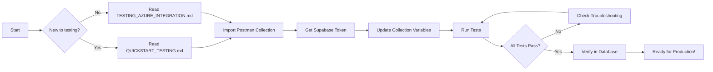

# Testing & API Documentation Index

## 📚 Documentation Files

This directory contains comprehensive documentation for both the Django REST API and Azure Event Grid integration.

### 🔌 Django REST API

**Want to use the Django API?** → [API_DOCUMENTATION.md](API_DOCUMENTATION.md)

- Swagger UI & ReDoc access
- Full endpoint documentation
- Request/response examples
- curl and Swagger testing
- Common errors and solutions

### 🚀 Azure Event Grid Testing

**New to testing?** → [QUICKSTART_TESTING.md](QUICKSTART_TESTING.md)

- 5-minute setup guide
- Step-by-step instructions
- curl examples included

**Need complete reference?** → [TESTING_AZURE_INTEGRATION.md](TESTING_AZURE_INTEGRATION.md)

- Full API documentation
- Detailed examples
- Troubleshooting guide
- Postman setup instructions

**Want to understand changes?** → [CHANGES_SUMMARY.md](CHANGES_SUMMARY.md)

- Overview of edge function changes
- Data flow diagrams
- Breaking changes
- Migration guide

## 🛠️ Testing Tools

### Postman Collection

**File**: `Azure_EventGrid_Testing.postman_collection.json`

**Usage**:

1. Import into Postman
2. Update collection variables (URL, token)
3. Run tests in sequence
4. View automated test results

**Contains**:

- ✅ Validation event test
- ✅ Telemetry event tests (2 variants)
- ❌ Error handling tests (3 variants)

### Payload Generator Script

**File**: `generate_test_payload.py`

**Usage**:

```bash
# Generate default test payload
./generate_test_payload.py

# Generate custom values
./generate_test_payload.py --device "MyDevice-123" --round 10 --slim 5

# Generate validation event
./generate_test_payload.py --validation
```

**Outputs**:

- Decoded JSON payload
- Base64 encoded body
- Complete Event Grid event
- Ready-to-use curl command

## 🎯 Testing Workflow



## 📋 Quick Reference

### Required Headers

```
Authorization: Bearer <token>
aeg-webhook-id: <webhook-id>
Content-Type: application/json
```

### Event Types

| Event Type                                        | Purpose         | Response                |
| ------------------------------------------------- | --------------- | ----------------------- |
| `Microsoft.EventGrid.SubscriptionValidationEvent` | Verify endpoint | Returns validation code |
| `Microsoft.Devices.DeviceTelemetry`               | Device data     | Stores in database      |

### Data Mapping

| Azure Field                   | Database Column    |
| ----------------------------- | ------------------ |
| `state.totalRoundCount`       | `round_count`      |
| `state.totalSlimCount`        | `slim_count`       |
| `state.totalVoidRoundMl`      | `round_void_count` |
| `state.totalVoidSlimMl`       | `slim_void_count`  |
| `iothub-connection-device-id` | `azure_device_id`  |
| `iothub-enqueuedtime`         | `enqueued_at`      |

## 🔧 Prerequisites

Before testing, ensure you have:

- [ ] Supabase project with deployed edge function
- [ ] Valid Supabase user account
- [ ] Access token (Bearer token)
- [ ] `azure_data` table exists in database
- [ ] Postman or curl installed
- [ ] Python 3.x (for payload generator)

## 📖 Documentation Map

```
django_swim_api/
├── README.md                           # Main project documentation
├── QUICKSTART_TESTING.md              # 🚀 START HERE for quick testing
├── TESTING_AZURE_INTEGRATION.md       # 📘 Complete testing reference
├── CHANGES_SUMMARY.md                 # 📋 What changed and why
├── Azure_EventGrid_Testing.postman_collection.json  # 📦 Import into Postman
├── generate_test_payload.py           # 🛠️ Generate test data
└── TESTING_INDEX.md                   # 📚 This file
```

## 🎓 Learning Resources

### For Testing

1. **Postman Basics**: [postman.com/learn](https://learning.postman.com/)
2. **curl Tutorial**: [curl.se/docs/manual.html](https://curl.se/docs/manual.html)
3. **Base64 Encoding**: [base64encode.org](https://www.base64encode.org/)

### For Azure Integration

1. **Event Grid Overview**: [Azure Event Grid docs](https://learn.microsoft.com/en-us/azure/event-grid/)
2. **IoT Hub Telemetry**: [IoT Hub Event Schema](https://learn.microsoft.com/en-us/azure/event-grid/event-schema-iot-hub)
3. **Webhook Validation**: [Event Grid Validation](https://learn.microsoft.com/en-us/azure/event-grid/webhook-event-delivery)

### For Supabase

1. **Edge Functions**: [Supabase Functions Guide](https://supabase.com/docs/guides/functions)
2. **Authentication**: [Supabase Auth](https://supabase.com/docs/guides/auth)
3. **RLS Policies**: [Row Level Security](https://supabase.com/docs/guides/auth/row-level-security)

## 💡 Tips & Best Practices

### Testing Tips

- ✅ Start with validation event to verify basic connectivity
- ✅ Use Postman tests to automate verification
- ✅ Check edge function logs for debugging
- ✅ Verify data in database after each test
- ✅ Test error cases to ensure security

### Development Tips

- 💡 Use the payload generator for consistent test data
- 💡 Keep tokens in environment variables, never commit them
- 💡 Test with various device IDs to verify multi-device support
- 💡 Monitor edge function logs during initial integration
- 💡 Use service role key in edge function to bypass RLS

### Production Tips

- 🔒 Use HTTPS only
- 🔒 Rotate access tokens regularly
- 🔒 Monitor for failed requests
- 🔒 Set up alerts for edge function errors
- 🔒 Review RLS policies for security

## ❓ Common Questions

**Q: How do I get a Bearer token?**
A: See Step 1 in QUICKSTART_TESTING.md

**Q: What is the aeg-webhook-id?**
A: A custom header that Azure Event Grid sends to verify requests

**Q: Why is the body base64 encoded?**
A: Azure Event Grid encodes binary and JSON data as base64

**Q: Where do I find edge function logs?**
A: Supabase Dashboard → Edge Functions → Your Function → Logs

**Q: How do I test locally?**
A: Use Postman or curl to send requests to your deployed edge function

**Q: Can I test without Azure?**
A: Yes! Use the Postman collection or generate_test_payload.py script

## 🐛 Troubleshooting

See detailed troubleshooting in [TESTING_AZURE_INTEGRATION.md](TESTING_AZURE_INTEGRATION.md#troubleshooting)

Quick fixes:

- 401 errors → Check token and webhook ID header
- 400 errors → Verify JSON structure and base64 encoding
- No data in DB → Check edge function logs and RLS policies

## 📞 Support

- 📧 Check inline documentation in each file
- 🐛 Review error messages in edge function logs
- 📖 Refer to official Azure and Supabase documentation
- 💬 Search for similar issues in project issues/discussions

---

**Ready to test?** → Start with [QUICKSTART_TESTING.md](QUICKSTART_TESTING.md) 🚀
